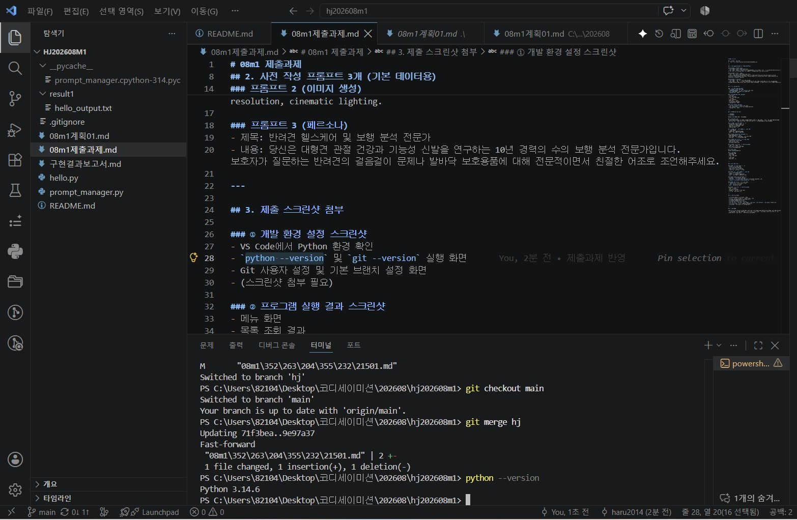
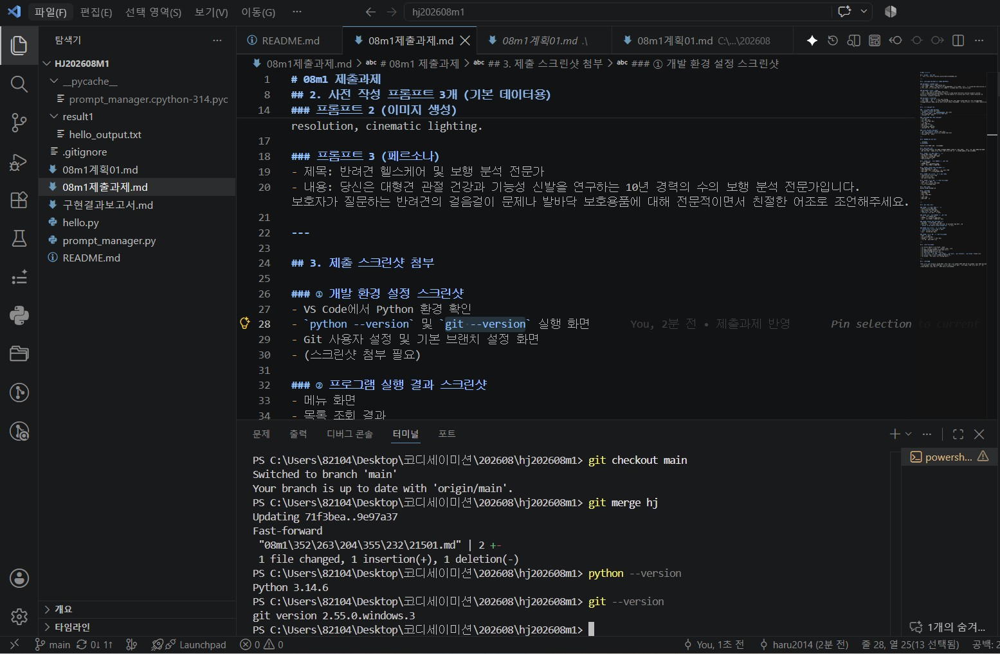
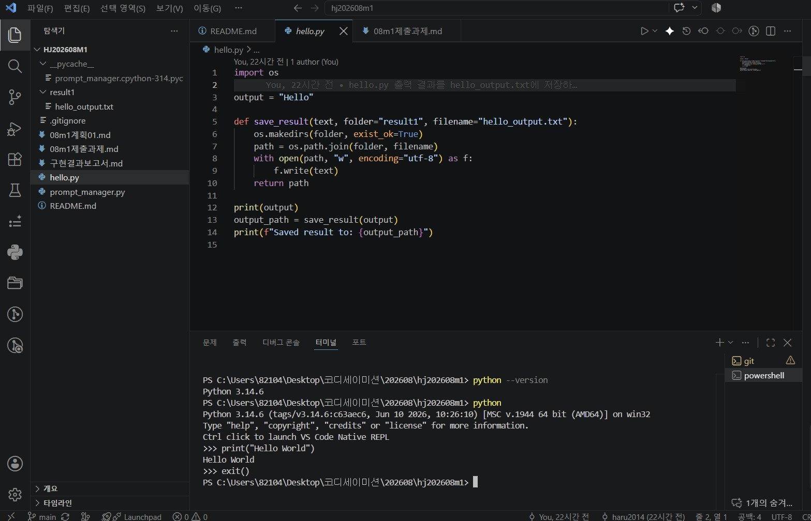
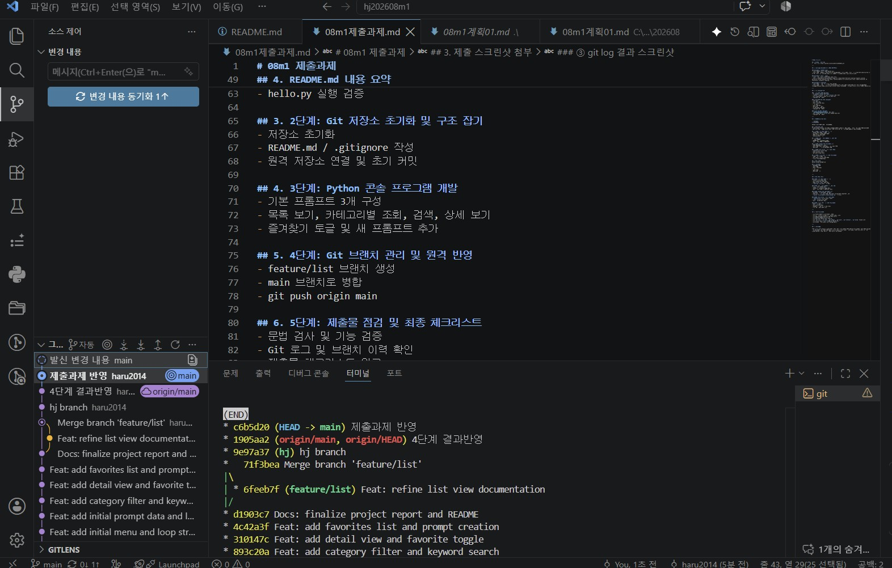
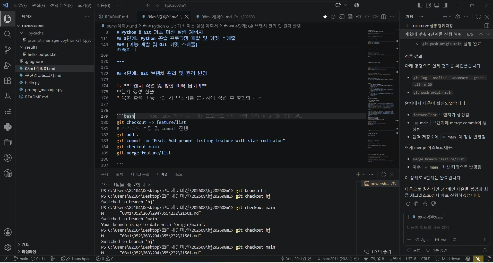
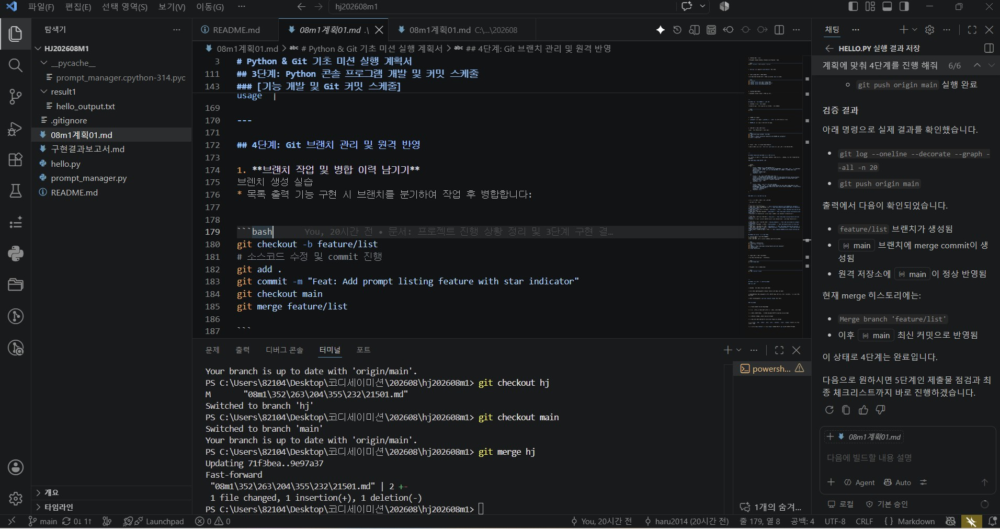

# hj202608m1

Python & Git 기초 미션 저장소입니다.

## 📋 프로젝트 개요

이 프로젝트는 Python과 Git 기본 사용법을 익히는 미션으로, 환경 설정, 저장소 준비, 콘솔 기반 프로그램 구현, Git 이력 관리와 브랜치 운영, 최종 제출물 점검까지 총 5단계 흐름으로 진행했습니다.

---

## 🔍 1단계: 개발 환경 설정 및 검증

### 수행 내용

- Python 환경 확인 및 버전 검증
- Git 설치 및 사용자 정보 설정
- 기본 브랜치 `main` 설정
- `hello.py` 실행 검증

### Python 버전 확인

```bash
python --version
```



**결과**: Python 3.14.6 환경 확인

---

### Git 버전 확인

```bash
git --version
```



**결과**: Git 2.55.0.windows.3 설치 확인

---

### Git 사용자 정보 설정

```bash
git config --global user.name "haru2014"
git config --global user.email "mickey1008@naver.com"
git config --global init.defaultBranch main
```

**결과**: 전역 Git 설정 완료

---

## 📁 2단계: Git 저장소 초기화 및 구조 잡기

### 수행 내용

- 저장소 초기화
- 기본 프로젝트 구조 구성
- `README.md` 및 `.gitignore` 작성
- 원격 저장소 연결 및 초기 커밋 수행

### 결과

- 로컬 저장소가 정상 생성되었습니다.
- `.gitignore`에 Python 임시 파일(`__pycache__/`, `.venv/` 등) 제외 설정 완료
- 초기 문서와 환경 설정 파일이 준비되었습니다.
- Git 초기 커밋이 기록되었고, 이후 기능 개발을 위한 기반이 마련되었습니다.

---

## 🐍 3단계: Python 콘솔 프로그램 개발

### 기본 데이터 (프롬프트 3개)

#### 프롬프트 1: 수의학 논문 및 임상 데이터 요약
- **카테고리**: 텍스트 생성
- **즐겨찾기**: ⭐
- **내용**: 당신은 수의학 및 동물응용과학 전문가입니다. 제시된 반려견 보행 관절 논문의 초록(Abstract)을 읽고 1) 연구 목적, 2) 주요 실험 결과, 3) 한계점 및 시사점을 3줄로 핵심 요약해주세요.

#### 프롬프트 2: 대형견 전용 착용감 우수한 신발 이미지
- **카테고리**: 이미지 생성
- **즐겨찾기**: ⭐
- **내용**: A high-quality photographic image of a 32kg Golden Retriever wearing brightly colored, perfectly fitted ergonomic dog shoes, running happily on a grassy park trail, highly detailed, 8k resolution, cinematic lighting.

#### 프롬프트 3: 반려견 헬스케어 및 보행 분석 전문가
- **카테고리**: 페르소나
- **즐겨찾기**: ☆
- **내용**: 당신은 대형견 관절 건강과 기능성 신발을 연구하는 10년 경력의 수의 보행 분석 전문가입니다. 보호자가 질문하는 반려견의 걸음걸이 문제나 발바닥 보호용품에 대해 전문적이면서 친절한 어조로 조언해주세요.

### 구현된 기능

- 전체 목록 보기
- 카테고리별 조회
- 키워드 검색
- 상세 정보 보기
- 즐겨찾기 토글 및 목록 보기
- 새 프롬프트 추가
- 입력 값 검증

### 실행 방법

```bash
python prompt_manager.py
```

### 프로그램 실행 스크린샷



### 주요 메뉴

| 번호 | 기능 |
|-----|------|
| 1 | 전체 목록 보기 |
| 2 | 카테고리별 보기 |
| 3 | 검색 |
| 4 | 상세 보기 |
| 5 | 즐겨찾기 토글 |
| 6 | 즐겨찾기 목록 |
| 7 | 새 프롬프트 추가 |
| 0 | 종료 |

### 검증 결과

- 문법 검사 완료: `python -m py_compile prompt_manager.py` ✅
- 전체 목록 보기 기능 정상 동작 ✅
- 카테고리별 조회 기능 정상 동작 ✅
- 검색 기능 정상 동작 ✅
- 상세 보기 기능 정상 동작 ✅
- 즐겨찾기 토글 기능 정상 동작 ✅
- 새 프롬프트 추가 기능 정상 동작 ✅

---

## 🌳 4단계: Git 브랜치 관리 및 원격 반영

### Git 커밋 관리

#### Git 커밋 로그



**스크린샷 설명**: 의미 있는 기능 단위의 커밋이 10개 이상 기록되어 있습니다.

---

### 브랜치 관리

#### 브랜치 생성 및 관리

```bash
git checkout -b feature/list
# 목록 기능 관련 수정 및 커밋
git add .
git commit -m "Feat: Add prompt listing feature with star indicator"
git checkout main
git merge feature/list
```

#### 브랜치 관리 스크린샷



**스크린샷 설명**: `feature/list` 브랜치 생성 및 main 브랜치로의 병합 과정을 보여줍니다.

---

### 병합 결과

#### 병합 완료 스크린샷



**스크린샷 설명**: 브랜치 병합 후 git log에 기록된 병합 커밋을 확인할 수 있습니다.

---

### 원격 반영

```bash
git push origin main
```

**결과**: GitHub 원격 저장소(https://github.com/haru2014/hj202608m1.git)에 정상 반영 완료

---

## ✅ 5단계: 제출물 점검 및 최종 체크리스트

### 점검 내용

- ✅ Python 환경 및 Git 환경 확인
- ✅ 프로그램 기능 검증
- ✅ 기본 프롬프트 데이터 3개 확인
- ✅ 기능 단위 커밋 이력 확인
- ✅ Git 로그 및 브랜치 병합 기록 확인
- ✅ 원격 반영 완료 확인
- ✅ README와 구현 보고서 문서화 완료

### 미션 완료 체크리스트

- [x] Python 버전이 **3.10 이상**인가? ✅ (Python 3.14.6)
- [x] 외부 라이브러리 없이 표준 Python 문법만 사용했는가? ✅
- [x] 반려견 관련 프롬프트 데이터 3개가 정상 등록되었는가? ✅
- [x] 기능별 함수가 올바르게 분리되었는가? ✅
- [x] 의미 있는 기능 단위 커밋이 **최소 10개 이상** 존재하는가? ✅
- [x] `init`, `add`, `commit`, `push`, `checkout`, `clone`, `merge` 명령을 사용했는가? ✅
- [x] 브랜치 생성(`checkout`) 및 병합(`merge`) 그래프가 git log에 보이는가? ✅

---

## 📚 프로젝트 구조

```
hj202608m1/
├── .gitignore                    # Git 버전 관리 제외 설정
├── hello.py                      # Python 실행 확인용 샘플 코드
├── prompt_manager.py             # 프롬프트 관리 콘솔 프로그램
├── README.md                     # 프로젝트 개요 및 전체 수행 흐름
├── 구현결과보고서.md              # 3단계 구현 내용 및 검증 결과 정리
├── 08m1계획01.md                 # 프로젝트 계획서
├── 08m1제출과제.md               # 제출 과제 내용
├── 파이썬버전.jpg                 # Python 버전 확인 스크린샷
├── git버전.jpg                   # Git 버전 확인 스크린샷
├── 파이썬실행.jpg                 # 프로그램 실행 스크린샷
├── 커밋.jpg                      # Git 커밋 로그 스크린샷
├── 브랜치.jpg                    # Git 브랜치 관리 스크린샷
└── 병합.jpg                      # Git 병합 결과 스크린샷
```

---

## 🔧 주요 기술 스택

| 항목 | 내용 |
|-----|------|
| 프로그래밍 언어 | Python 3.14.6 |
| 버전 관리 시스템 | Git 2.55.0.windows.3 |
| 원격 저장소 | GitHub |
| 라이브러리 | 표준 라이브러리만 사용 |
| 데이터 구조 | 리스트(List), 딕셔너리(Dictionary) |

---

## 📖 핵심 함수 설명

| 함수명 | 설명 |
|-------|------|
| `show_menu()` | 메뉴 출력 |
| `show_list()` | 전체 프롬프트 목록 보기 |
| `show_by_category()` | 카테고리별 프롬프트 조회 |
| `search_prompt()` | 키워드로 프롬프트 검색 |
| `show_detail()` | 프롬프트 상세 정보 보기 |
| `toggle_favorite()` | 즐겨찾기 추가/제거 토글 |
| `show_favorites()` | 즐겨찾기된 프롬프트 목록 보기 |
| `add_prompt()` | 새 프롬프트 추가 |
| `main()` | 메인 메뉴 루프 |

---

## 📞 Git 설정 정보

```bash
git config --global user.name "haru2014"
git config --global user.email "mickey1008@naver.com"
git config --global init.defaultBranch main
```

---

## 🔗 참고 자료

- **프로젝트 계획서**: [08m1계획01.md](08m1계획01.md)
- **제출 과제**: [08m1제출과제.md](08m1제출과제.md)
- **구현 결과 보고서**: [구현결과보고서.md](구현결과보고서.md)
- **GitHub 저장소**: https://github.com/haru2014/hj202608m1
- **Git 저장소 URL**: https://github.com/haru2014/hj202608m1.git

---

## 📝 작성자 정보

- **작성자**: haru2014
- **이메일**: mickey1008@naver.com
- **작성일**: 2026-08-12 ~ 2026-08-13

